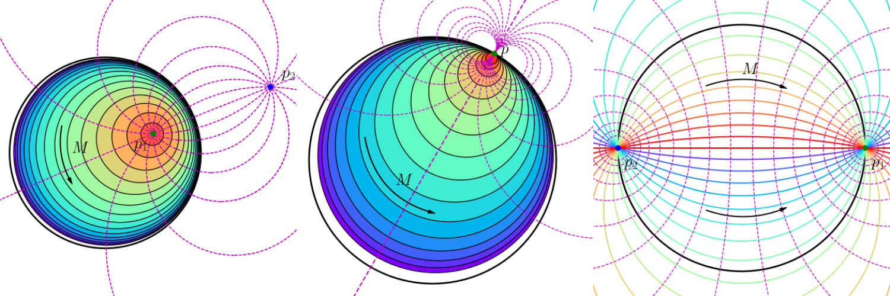
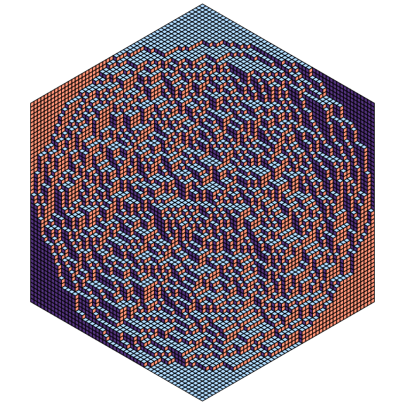
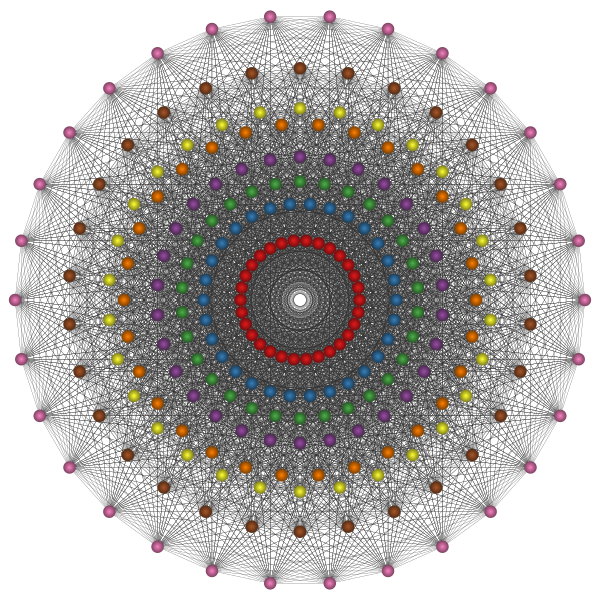

# A Tour in the Wonderland of Math with Python

> **A collection of python scripts for drawing beautiful figures and animating interesting algorithms in mathematics**.

## About this repo

The purpose of this project is to show the beauty of math with python by rendering high quality images, videos and animations. It consists of several independent projects with each one illustrates a special object/algorithm in math. The topics are chosen largely due to my personal taste:

1. They must produce appealing results.
2. There must be some non-trivial math behind them.
3. The code should be as simple as possible.

# What's fun here

## Todd-Coxeter algorithm and uniform polytopes

Use Todd-Coxeter algorithm to compute the data of a polytope, and render it in POV-Ray.

[[Book]](https://www.routledge.com/Handbook-of-Computational-Group-Theory/Holt-Eick-OBrien/p/book/9780367659448) | [[Doc]](https://pywonderland.com/polytopes)


## Möbius transformations

+ When a Möbius transformation is an isometry of the hyperbolic disk, it must be of elliptic/parabolic/hyperbolic type, and it's elliptic/parabolic/hyperbolic if and only if it's a composition of reflections about two intersecting/parallel/hyper-parallel mirrors.

    

+ A Möbius transformation can be uniquely extended to an isometry of the hyperbolic upper-half space.

    

+ Coxeter automata and 2D Uniform tilings

[[Casselman's Paper]](https://personal.math.ubc.ca/~cass/research/pdf/roots.pdf) | [[Doc]](https://pywonderland.com/uniform-tilings/)


## GIF animations of maze and cellular automata

Generate maze animations containing thousands of frames in a few seconds. No external libs used and no drawing api call!

[[Doc]](https://pywonderland.com/gifmaze)

|    |    |
|:---:|:---:|
|  |     |
|  |  |


## Domino shuffling algorithm

This algorithm samples a perfectly random tiling of a aztec diamond.

[[Mathologer Video]](https://www.youtube.com/watch?v=Yy7Q8IWNfHM) | [[Paper]](https://arxiv.org/abs/math/9201305)


## Propp and Wilson's coupling from the past algorithm

[[Book](https://www.cambridge.org/core/books/finite-markov-chains-and-algorithmic-applications/EE10AF27811B43B02E05905DC6413467)]



## Catacaustics of plane curves

Use sympy to compute catacaustics of parametric and implicit curves.

[[Doc](https://pywonderland.com/catacaustics)]

|   |   |
|:---:|:---:|
| Cardioid as a catacaustic of circle | Nephroid as a catacaustic of cardioid |
| | |


## Coxeter element and Coxeter plane

We explain how to project the E8 root system to its Coxeter plane.

[[Casselman's Paper](https://personal.math.ubc.ca/~cass/research/pdf/Element.pdf)] | [[Doc](https://pywonderland.com/e8-and-coxeter-plane/)]

|   |    |
|:---:|:---:|
| E8   |  5-Cube   |
|  |  |

# How to use

All projects here are implemented in a ready-to-use manner for new comers. You can simply run the examples without tweaking any parameters once you have the dependencies installed correctly.

# Dependencies

The recommended way to install all dependencies is simply running the bash script `install_dependencies.sh`.

```
sudo bash install_dependencies.sh
```

Or you can install the python libs by pip:

```
pip install -r requirements.txt
```

Open source softwares required:

+ `python3-tk` (for file dialog)
+ `ImageMagick` (for making gif animations)
+ `FFmpeg` (for saving animations to video files)
+ `POV-Ray` (for generating high quality raytracing results)
+ `graphviz` (for drawing automata of Coxeter groups)
+ `Inkscape` (optional, for convering large svg files to png)

They can all be installed via command-line:

```
sudo apt-get install python3-tk imagemagick ffmpeg povray graphviz inkscape
```


Note `pygraphviz` also requires `libgraphviz-dev`:

```
sudo apt-get install libgraphviz-dev
```

In the scripts these softwares are called in command line as `povray`, `ffmpeg`, `convert` (from `ImageMagick`), etc. For Windows users you should add the directories contain these .exe files to the system `Path` environment variables to let the system know what executables these commands refer to. For example on Windows the default location of POV-Ray's exe file is `C:\Program Files\POV-Ray\v3.7\bin\pvengine64.exe`, so you should add `C:\Program Files\POV-Ray\v3.7\bin` to system `Path` and rename `pvengine64.exe` to `povray.exe`, then you can run the scripts without any changes and everything should work fine.

## Thanks

I have learned a lot from the following people:

- [Bill Casselman](http://www.math.ubc.ca/~cass/)
- [Roice Nelson](https://github.com/roice3)
- [Possibly Wrong](https://possiblywrong.wordpress.com/)
- [Jos Leys](http://www.josleys.com/)
- [Greg Egan](http://gregegan.net/)
- [Matthew Arcus](https://github.com/matthewarcus).

## License

see the LICENSE file.
